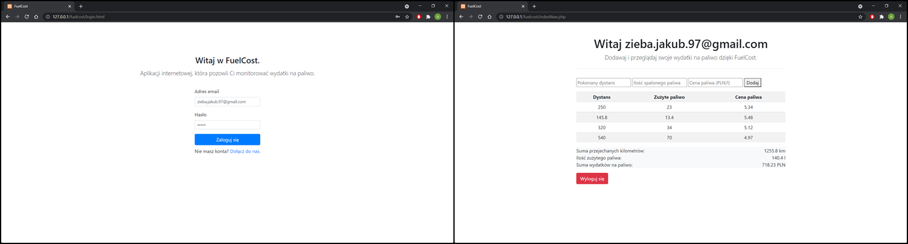
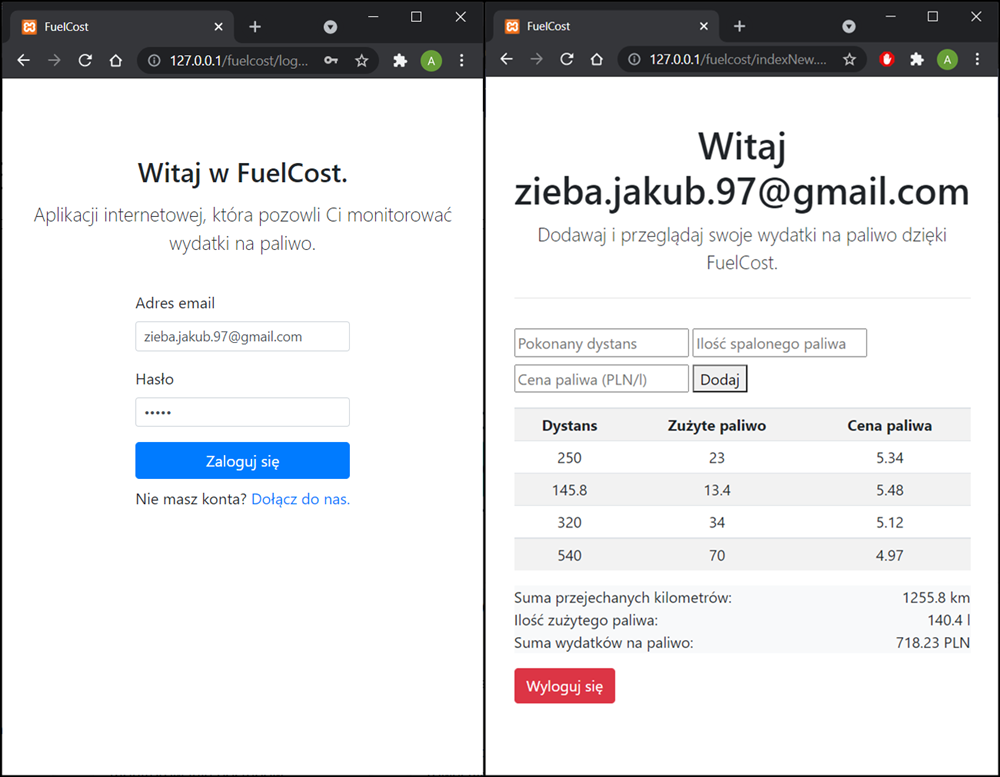

<h1 align="center">
 <strong>FuelCost</strong>
   
</h1>

## Table of contents
* [Introduction](#introduction)
* [Features](#features)
* [Screenshots](#screenshots)
* [Technologies](#technologies)
* [License](#license)

## Introduction
Simple web application, which allows user to create an account,
and add fuel expenses.

## Features
* Create an account
* Add fuel expenses
* View historical fuel expenses
* See summary of expenses

## Screenshots

   
 

## Technologies
* HTML, CSS, Boostrap
* PHP with PDO usage 
* MySQL Databse

Application tested on Windows 10, Chrome 91.0.4472

## License
GNU General Public License v3.0
